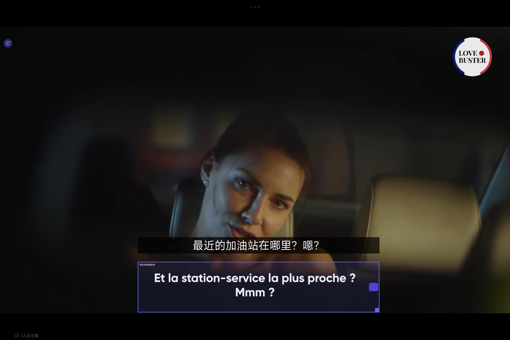
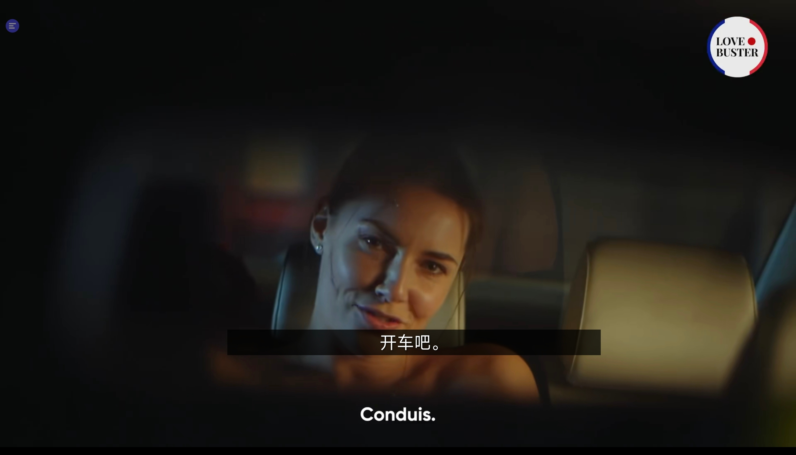

# scan_translate · 字幕宝

[English](README.md) · [简体中文](README.zh-CN.md)

`scan_translate` (字幕宝) is an open-source Android overlay for translating subtitles while watching shows in other languages. It was created to make language learning more convenient: place the scan box over the subtitle, and the translated text appears above it.

## Teaser

<table>
  <tr>
    <td align="center">
      
      <br />
      <sub>1. Set up scan area</sub>
    </td>
    <td align="center">
      
      <br />
      <sub>2. Confirm to hide the scan area</sub>
    </td>
  </tr>
</table>

## Features

- A floating ball stays above other apps. It starts inactive at full opacity; tap it to enter the active state at 50% opacity, show the scan box, and start OCR and translation. Tap it again to hide the box and stop OCR and translation.
- Drag the scan box to move it, or drag its bottom-right handle to resize it. The last position and size are saved.
- A new translation is requested only when the recognized text changes.
- On-device ML Kit OCR and translation are used by default. DeepL API is also available as an optional engine.
- Configure source and target languages, font size, text color, OCR interval, and translation display duration.

## Getting started

1. Open the project in Android Studio Hedgehog or newer and wait for Gradle sync.
2. Run it on Android 8.0 (API 26) or newer.
3. In the settings screen, grant the permission to display over other apps and approve screen capture.
4. Tap the floating ball to activate it, position the scan box over the subtitle, and tap the ball again when you want to stop scanning.
5. The first use of an on-device translation language pair downloads its model. Wi-Fi is recommended for this download.

DeepL requests use `https://api-free.deepl.com/v2/translate`. The API key is stored only in the device's SharedPreferences and is never committed to this repository.

## Architecture

- `MainActivity`: settings screen, permissions, and MediaProjection authorization.
- `OverlayService`: foreground service, floating ball, scan box, screen frames, OCR, translation, and result display.
- `ScanBoxView`: scan box movement, resizing, and geometry save interaction.
- `AppPrefs`: persistent user settings and scan box geometry.

Screen capture uses Android MediaProjection. OCR and the default translation engine run on the device. The app does not save full screenshots; it keeps the current frame in memory only long enough to crop the selected scan area.

## Build

The project uses AGP 8.5.2, Kotlin 2.0.21, and JDK 17. Open it in Android Studio and run the `app` configuration after Gradle sync. If Gradle is installed locally, you can also run:

```bash
gradle assembleDebug
```

The development container used to prepare this repository does not include the JDK or Android SDK, so a Gradle build was not run here. Android Studio can sync, build, and debug the project locally.

## Continuous integration

Every push starts the `Build APK` GitHub Actions workflow. It builds the debug APK with JDK 17 and Gradle 8.7, then uploads it as an artifact named `scan_translate-debug-<commit-sha>`. Pushes to `main` also publish a prerelease containing the APK under the repository's **Releases** page. Feature-branch builds remain available from the run's **Artifacts** section.

## License

MIT License. Issues and pull requests are welcome.
